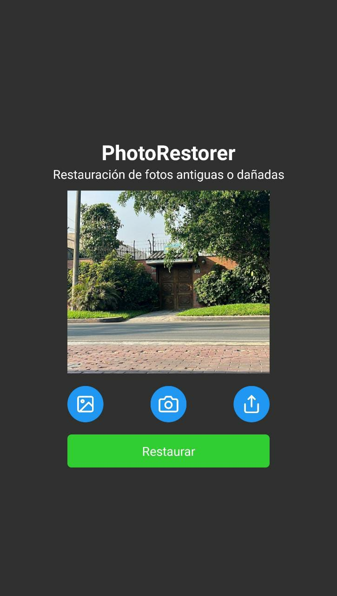

# PhotoRestorer: Restauración de fotos antiguas o dañadas

###### Frontend de Aplicación en React Native

## Descripción

* La aplicación permite subir o tomar una imagen del usuario.

* Una vez seleccionada la imagen se puede enviar a un servidor backend realizado en Python para poder recontruirla.

* Se puede compartir el resultado de la imagen reconstruida.

## Capturas

Lima, 2023